# Prompt Library V2 - Electric Boogaloo

This architecture review proposes a new version of the AIPrompts library.
The goal is to provide a more powerful and extensible prompt library that supports multiple data types (i.e., beyond textual inputs), can be used for a variety of tasks and models, and future-proof for unforeseen use cases and unplanned complex workflows.
We aim to provide a brief overview of LLMs, a justification for the existance of an upgraded version of the library, the library's current shortcomings, a description of the ideal use cases we wish to support, and the rationale for its new design.

## Introduction

A prompt is an array of data that is provided to a model as input to instruct it on how it should operate (e.g., what task should be performed, additional specifications and/or restrictions, etc.).
Before being processed by a model, a prompt is typically represented using text; however, prompt data can also appear in different formats or include other types of data (e.g. images, multimodal models).
Prompts appear in many formats/standards, and a prompt format may not be compatible between models, even for models that use the same training regimen and perform the same task.
Several recent AI technologies, such as Large Language Models (LLMs) and Image generation models, use prompts.

TeiaLabs makes heavy use of prompts in several projects, and we have developed a publicly-available package named "AIPrompts" to make it easier to build prompts.
However, the current version of AIPrompts has some limitations and is missing some important features.
We propose to redesign the prompt package to provide users with:

- Prompts that support multimodal inputs
- A templating engine (Jinja) to make textual prompts more dynamic/powerful by allowing users to reuse components
- A prompt input abstraction that is modeled at the "atomic" level (e.g., modeling a chat conversation at the message level) to increase the flexibility of prompt creation
- A separation between prompt creation and execution settings (model config/exec) to allow using the same base prompts for several models
- Compatibility between different prompt standards and model providers
- Serialization and deserialization capabilities

## Background

An autoregressive Language Model (LM) typically consumes text as input and produces text as output.
There are several preprocessing steps required to convert the text into a format that is suitable for model consumption.
For example, a model might require that the text be tokenized and embedded into a vector representation based on its vocabulary and learned semantic representations.
The diagram below depicts, at a high-level, the common preprocessing steps of a text-based LM:

```mermaid
graph TB
    subgraph input["Input"]
        direction TB
        text_input["'The ball is red'"]
    end

    subgraph encoding["Text Encoding"]
        direction TB
        subgraph tokenization["Tokenization"]
            direction TB
            subgraph tokenizer_out[" "]
                direction LR
                text_tokenized["['The', 'ball', 'is', 'red']"]
                tokenizer["Tokenizer"]
            end
            subgraph vocabulary_out[" "]
                direction LR
                text_token_ids["[12, 35, 67, 10]"]
                vocabulary["Vocabulary"]
            end
        end

        subgraph embedding["Embedding"]
            direction LR
            text_embedded["(N x D) Matrix"]
            embedder["Embedding\nLayer"]
        end

    end

    llm_input["LLM-compatible Input"]
    model["LLM"]

    text_input --> text_tokenized
    text_tokenized --> text_token_ids
    text_token_ids --> text_embedded
    text_embedded --> llm_input
    llm_input --> model

    embedder -.- model

    classDef inputbox fill:#00000000,stroke-width:0px
    classDef inputtext fill:#FF222222
    class input inputbox
    class text_input inputtext

    classDef encodingbox fill:#00FFFF22,stroke-width:3px
    classDef encodingstep fill:#FFFFFF22,stroke-width:3px,stroke-dasharray: 5 5
    classDef transparent fill:#00000000,stroke-width:0px
    class encoding encodingbox
    class tokenization,embedding encodingstep
    class tokenizer_out,vocabulary_out transparent

    classDef modelstyle fill:#163A52
    class model modelstyle
```



Although LMs are typically used to process and generate textual data, several approaches have been proposed to use LMs for other data types.
Multimodal LLMs (MLLMs) are models that are trained to process multiple input types simultaneously and can potentially generate outputs in multiple formats.
Adding support for more data types increases the range of tasks that can be supported and opens up a wide range of possible use cases.
As an example, Vision-Language Models (VLMs) are a type of MLLM that typically receives both visual and textual data and generates textual outputs.

The exact mechanism by which these models are trained and process each data type varies by model; the optimal way to do this is still an open research question.
Approaches typically involve translating data into a "universal" format that is compatible with the model.
This may include using special delimitation tokens to signal the beginning and end of each data type, using a common semantic representation for all data types (i.e., a shared embedding space), or even translating data types to text.
The diagram below depicts, at a high-level, the common preprocessing steps of an MLLM:

```mermaid
graph TB
    subgraph input["Input"]
        direction TB
        subgraph input_set[" "]
            direction TB
            image_input["<img src='./res/car.jpeg' height='100'>'What color is the car?'"]
        end
    end

    subgraph encoding["Encoding"]
        direction TB
        encoder_selector{"Encoder\nSelector"}
        subgraph encoders["Encoder Collection"]
            direction LR
            text_encoder["Text Encoder"]
            image_encoder["Image Encoder"]
            other_encoders["..."]

            text_encoder ~~~ image_encoder
            image_encoder ~~~ other_encoders
        end


        encoder_selector --> encoders
    end

    llm_input["LLM-compatible Input List"]
    model["LLM"]

    input_set --> encoding
    encoding --> llm_input
    llm_input --> model

    classDef image width:100px,height:100px
    class image image_input

    classDef transparent fill:#00000000,stroke-width:0px
    classDef inputbox fill:#FF222222,stroke-width:2px
    classDef inputtext fill:#00000000,stroke:#00000000
    class input,image_input transparent
    class input_set inputbox
    class text_input inputtext

    classDef encoderbox fill:#FFFFFF22,stroke-width:3px,stroke-dasharray: 5 5
    classDef text_encoder fill:#00FFFF22,stroke-width:1px
    classDef image_encoder fill:#FF222222,stroke-width:1px
    classDef other_encoders fill:#FFFFFF22,stroke-width:1px,stroke-dasharray: 5 5
    classDef encoder_decider fill:#FFFFFF22,stroke-width:1px,stroke-dasharray: 5 5
    class encoding encoderbox
    class encoder_decider encoder_decider
    class encoders other_encoders
    class text_encoder text_encoder
    class image_encoder image_encoder
    class other_encoders transparent

    classDef modelstyle fill:#163A52
    class model modelstyle
```



When scaled to large datasets and parameter sizes, LMs display impressive performance in many tasks.
Due to their generalization capabilities, these models are used as-is for several tasks or as base models for more complex architectures.
In this case, these models are referred to as Foundation Models (FMs).
We hypothesize that future Foundation Models will be multimodal.
For this reason, it is important to provide support for multimodal FMs in our prompt building library.

## AIPrompts V1

### Usage Example & Limitations

The base building block of AIPrompts V1 is the [`TurboPrompt`](https://github.com/TeiaLabs/prompts/blob/master/prompts/turbo.py) class object.
Even though this object can be used to create prompts directly in Python code, usually prompts are created via JSON/YAML files and stored in a database for later use.
Here is an example of a JSON file containing the definition of a prompt:

```json
{
    "description": "A chatbot prompt.",
    "name": "chatbot",
    "settings": {
        "model": "gpt-3.5-turbo-16k",
        "max_tokens": 5000,
        "temperature": 0.25
    },
    "assistant_templates": [
        {
            "template_name": "assistant_prompt",
            "template": "<message>"
        }
    ],
    "system_templates": [
        {
            "template_name": "system_prompt",
            "template": "You are a chatbot called <bot_name>."
        },
        {
            "template_name": "alternate_system_prompt",
            "template": "You are a robot named <bot_name>."
        }
    ],
    "user_templates": [
        {
            "template_name": "user_prompt",
            "template": "<question>"
        }
    ]
}
```

Key observations:

- A prompt contains `<variables>`.
Their actual contents are dynamically replaced by user inputs.
- The definition of a prompt is tightly coupled with a model (`settings` object).
- The prompt format is compatible only for chat-based applications (textual).
Although this is the main usage for prompts right now, it may be expanded in the future to other data types, model types, and tasks.

Based on that prompt template, here is an example of how it is used via the MeltingFace API:

```json
{
    "prompt_inputs": [
        {
            "role": "system",
            "inputs": {
                "bot_name": "AllAi"
            },
            "template_name": "system_prompt"
        },
        {
            "role": "user",
            "inputs": {
                "question": "What is your name?"
            },
            "template_name": "user_prompt"
        }
    ],
    "prompt_name": "chatbot"
}
```

Key observations:

- The user must choose a single template among the available templates for each role in the chat conversation.
- The user provides values that replace variables in the rendered version of the prompt.

Although the current prompt template format is practical for simple use cases, it is impossible/impractical to:

- Create conditional rendering flows based on input variables.
If a user wants custom behavior for a prompt, they must implement the "rendering logic" by themselves and provide the final variable value to replace in the template.
- Support multiple model types for the same prompt; we would have to create multiple entries for the same prompt template for each model type.
- Compose prompts based on other artifacts, such as text snippets, different output formats, pieces of prompt definitions, or even entire prompts.
Each prompt must be defined from scratch.

## AIPrompts V2

### Ideal Use Cases

We provide a (non-exhaustive) list of use cases that AIPrompts V2 should satisfy:

- Python library providing prompt objects to create, compose, and render prompt templates based on other component object references.
- Multimodality support for prompts.
In initial versions, we should provide support at least for text and image types.
- Prompt rendering based on a user-provided context with support for multiple output formats (e.g. generic text completion, and ChatML and Llama 2 Chat for chatbot applications).
- Conditional rendering flows based on input variables (provide summary of a long-running conversation to the bot).
- Database/library of prompt objects and components (text snippets, output formats, etc.) for complex prompt creation use cases and prototypical/optimized phrases for specific tasks (ReAct for agents).
- Prompt reusability between different model settings and providers (run using GPT-3.5/4 or Llama 2).
- Prompt serialization and deserialization for storage/transmission.

### Schema Design

"Atomic" prompt object schemas:

```py
# Base artifact for all "atomic" prompt objects
class BasePromptArtifact(BaseModel):
    content: bytes | str  # specific artifacts override this type hint
    id: str  # based on hashable fields (content, name, type)
    name: str  # unique identifier to reference an artifact
    type: str  # artifact type (specific artifacts override this)

# Text artifact
class TextArtifact(BasePromptArtifact):
    content: str
    type: Literal["text"]

# Chat artifact
class ChatMessageArtifact(BasePromptArtifact):
    content: str
    role: Literal["assistant", "system", "user"]
    sender_name: Optional[str]
    type: Literal["chat_message"]

# Binary blob artifact
class BlobArtifact(BasePromptArtifact):
    content: bytes
    encoding: Literal["base64", "reference"]
    source: Optional[str]  # if we have to download (URL, path, ...)
    type: Literal["audio", "image", "video"]
```

Template schemas:

```py
# Base prompt template
class BasePromptTemplate(BaseModel):
    artifacts: list[BasePromptArtifact | BasePromptTemplate]
    description: str = ""  # template description
    id: str  # based on hashable fields (name, type, artifacts)
    metadata: dict[str, Any]  # additional data about the template
    name: str  # unique identifier to reference a template
    type: str  # template type (specific templates override this)

# Text completion prompt template
class TextCompletionPromptTemplate(BasePromptTemplate):
    prompt: str  # references artifact names
    type: Literal["text_completion"]

# Chat prompt template
class ChatPromptTemplate(BasePromptTemplate):
    message_list: list[str]  # references chat messages names (ordered)
    type: Literal["chat_prompt"]
```

### Text Completion Example

Python object representation:

```py
# Text artifact
text_sample = TextArtifact(
    name="text_1",
    content="The quick brown fox jumps over the lazy dog.",
)

# Text completion prompt template
template = TextCompletionPromptTemplate(
    name="text_completion_example",
    description="Example text completion prompt.",
    metadata={"tags": ["examples"]},
    artifacts=[text_sample],
    prompt="How many words are in the next sentence: {{ text_1 }}",
)
```

Generated JSON payload:

```json
{
    "name": "text_completion_example",
    "description": "Example text completion prompt.",
    "type": "text_completion",
    "id": "<computed automatically>",
    "metadata": {
        "tags": ["examples"]
    },
    "artifacts": [
        {
            "name": "text_1",
            "type": "text",
            "id": "<computed automatically>",
            "content": "The quick brown fox jumps over the lazy dog."
        }
    ],
    "prompt": "How many words are in the next sentence: {{ text_1 }}"
}
```

### Chat Example

Python object representation:

```py
# Image artifact
image_artifact = BlobArtifact(
    name="image_1",
    type="image",
    encoding="base64",
    content=b"<base64 encoded image>",
)

# Bot persona artifact
bot_persona = TextArtifact(
    name="bot_persona",
    content="You are a helpful chatbot.",
)

# Chat system message artifact using bot persona as reference
system_bot_persona = ChatMessageArtifact(
    name="system_bot_persona",
    role="system",
    sender_name="God",
    content="{{ bot_persona }} Always answer ironically.",
)

# Chat user message artifact asking about the contents of an image
user_image_question = ChatMessageArtifact(
    name="user_image_question",
    role="user",
    sender_name="John Doe",
    content="What is happening in image {{ image_1 }}?",
)

# Chat prompt template
template = ChatPromptTemplate(
    name="prompt_example",
    description="Example prompt to demonstrate functionalities.",
    metadata={"tags": ["examples"]},
    artifacts=[
        image_artifact,
        bot_persona,
        system_bot_persona,
        user_image_question,
    ],
    message_list=[
        system_bot_persona.name,
        user_image_question.name,
    ],
)
```

Generated JSON payload:

```json
{
    "name": "prompt_example",
    "description": "Example prompt to demonstrate functionalities.",
    "type": "chat_prompt",
    "id": "<computed automatically>",
    "metadata": {
        "tags": ["examples"]
    },
    "artifacts": [
        {
            "name": "image_1",
            "type": "image",
            "id": "<computed automatically>",
            "content": "<base64 encoded image>",
            "encoding": "base64"
        },
        {
            "name": "bot_persona",
            "type": "text",
            "id": "<computed automatically>",
            "content": "You are a helpful chatbot."
        },
        {
            "name": "system_bot_persona",
            "type": "chat_message",
            "id": "<computed automatically>",
            "sender_name": "God",
            "role": "system",
            "content": "{{ bot_persona }} Always answer ironically."
        },
        {
            "name": "user_image_question",
            "type": "chat_message",
            "id": "<computed automatically>",
            "sender_name": "John Doe",
            "role": "user",
            "content": "What is happening in image {{ image_1 }}?"
        }
    ],
    "message_list": [
        "system_bot_persona",
        "user_image_question"
    ]
}
```
